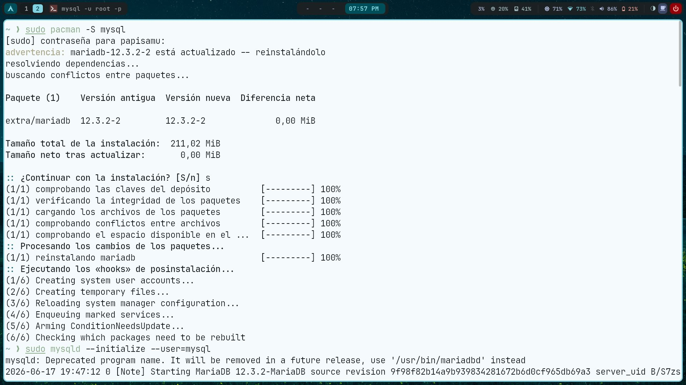
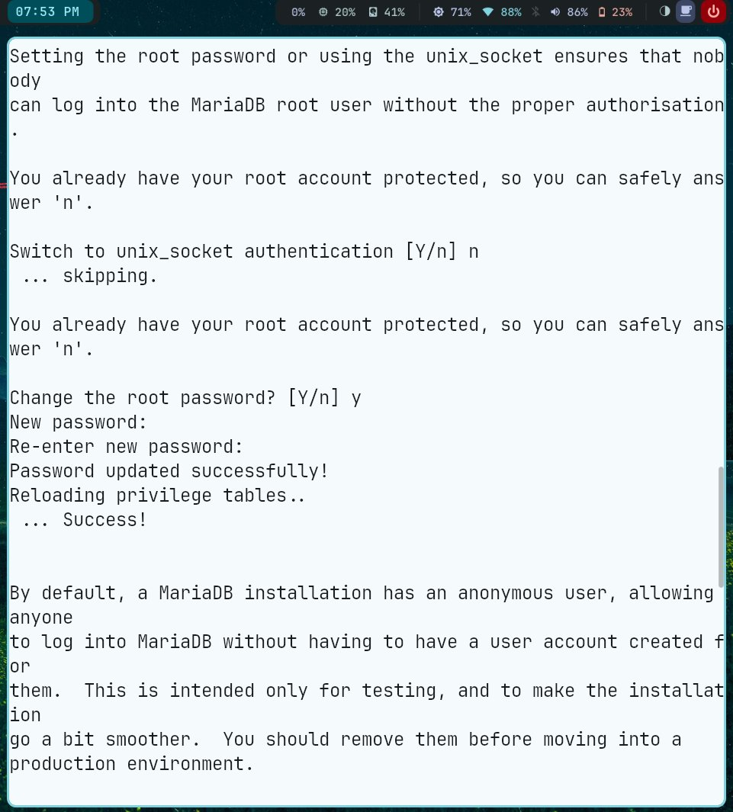
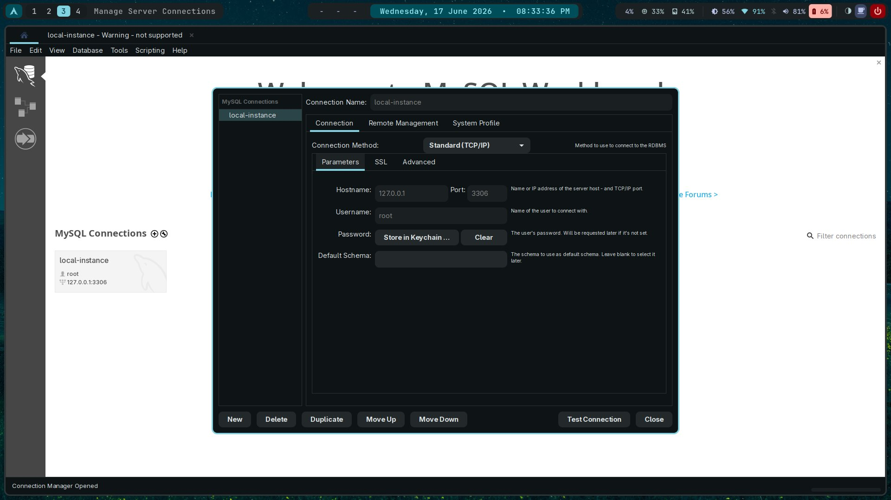
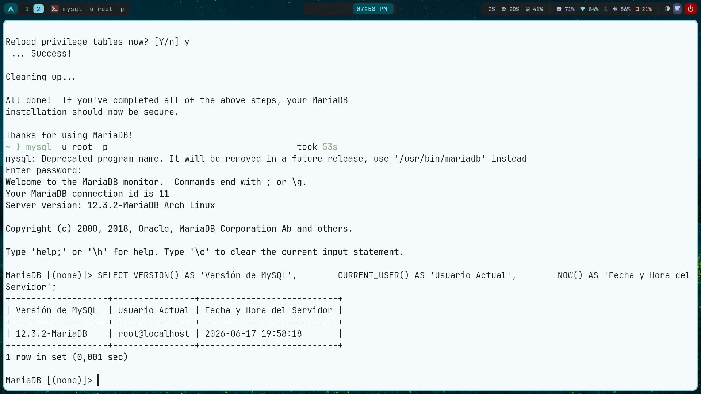

# Instalación y Configuración de MySQL

## Información del Estudiante

| Campo | Detalle |
|:---|:---|
| **Nombre completo** | Samuel David Gelvez Rodriguez |
| **Sistema Operativo** | Linux Arch |
| **Motor de base de datos** | MariaDB 12.3.2 (fork oficial de MySQL) |

---

## Proceso de Instalación

### 1. Descarga e Instalación
Se instaló **MariaDB** (fork oficial de MySQL) usando el gestor de paquetes `pacman`, que es el gestor nativo de Arch Linux y Manjaro:

```bash
sudo pacman -S mysql
```

El sistema detectó que MariaDB ya estaba presente en el sistema y procedió a reinstalar/actualizar el paquete `mariadb 12.3.2-2` correctamente.

### 2. Configuración de Credenciales
Se ejecutó el asistente de seguridad para proteger la instalación y definir la contraseña del usuario `root`:

```bash
sudo mysql_secure_installation
```

Durante este proceso se realizó lo siguiente:
- Se desactivó la autenticación por `unix_socket`
- Se estableció una contraseña segura para el usuario `root`
- Se eliminaron los usuarios anónimos
- Se deshabilitó el acceso remoto de `root`
- Se recargaron las tablas de privilegios

### 3. Instalación de MySQL Workbench
Se instaló la herramienta visual MySQL Workbench:

```bash
sudo pacman -S mysql-workbench
```

Se creó una conexión local con los siguientes parámetros:
- **Connection Name:** Local Instance
- **Hostname:** 127.0.0.1
- **Port:** 3306
- **Username:** root

Para permitir la conexión desde Workbench fue necesario cambiar el método de autenticación del usuario `root` a `mysql_native_password`:

```sql
ALTER USER 'root'@'localhost' IDENTIFIED VIA mysql_native_password USING PASSWORD('****');
FLUSH PRIVILEGES;
```

---

## Galería de Evidencias

### Captura 1 — Instalación del paquete MariaDB


> Instalación exitosa del paquete `mariadb 12.3.2-2` mediante `sudo pacman -S mysql` en Manjaro Linux.

---

### Captura 2 — Configuración de contraseña root


> Ejecución de `mysql_secure_installation`: se definió la contraseña del usuario `root` y se aplicaron las configuraciones de seguridad recomendadas.

---

### Captura 3 — MySQL Workbench con conexión local


> Interfaz de MySQL Workbench con la conexión "Local Instance" configurada apuntando a `127.0.0.1:3306` con el usuario `root`.

---

## Validación del Entorno

Para confirmar que la instalación fue exitosa se ejecutó la siguiente consulta SQL dentro del monitor de MariaDB:

```sql
SELECT VERSION() AS 'Versión de MySQL', 
       CURRENT_USER() AS 'Usuario Actual', 
       NOW() AS 'Fecha y Hora del Servidor';
```

**Resultado obtenido:**

---

### Captura 4 — Validación del entorno


> Resultado de la consulta de validación mostrando la versión de MariaDB (`12.3.2-MariaDB`), el usuario actual (`root@localhost`) y la fecha/hora del servidor (`2026-06-17 19:58:18`).

✅ La instalación fue completada exitosamente. El motor de base de datos MariaDB se encuentra operativo y listo para ser utilizado.

---
